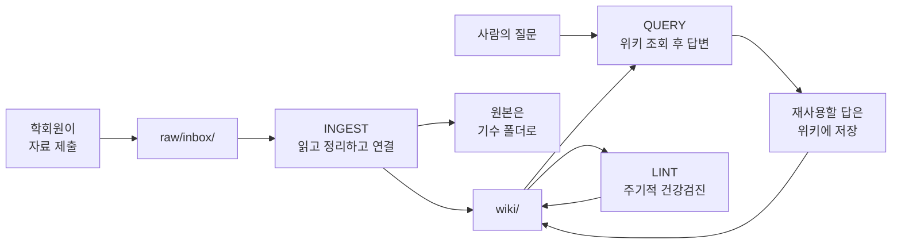

# OPT WIKI는 무엇이고 어떻게 작동하는가

AI 연합 학회 OPT의 지식 아카이브, 'OPT WIKI'에 대한 소개 문서입니다.

**OPT의 2026 여름 방학 활동으로 진행되는 '개발트랙'의 하네스 엔지니어링 프로젝트 산출물입니다.**

---

## 1. 무엇인가

**LLM이 읽고 정리하고 자동으로 구조화해주는 학회 지식베이스**

학회원이 자료를 던져 넣으면, LLM 에이전트가 그것을 읽고 요약 페이지를 만들고, 이를 기존에 체계화 해둔 아카이브(로컬 환경에서 폴더 구조 생각하면 됨)에 갱신하고, 서로 링크를 걸어 저장한다.

사람은 자료를 넣으며 프롬프팅을 하고(넣기만 해도 됨), 나머지 정리 노동은 에이전트가 한다.

Markdown 파일과 Git으로만 이루어져 있다. 데이터베이스도, 서버도, 검색 엔진도 없다.

## 2. 왜 만들었나

학회는 기수마다 사람이 바뀐다. 그리고 매번 같은 일이 반복된다.

- 작년에 이미 읽은 논문을 처음부터 다시 읽는다
- 재작년에 실패한 기술 선택을 또 시도한다
- 행사 준비에서 같은 실수를 반복한다
- 잘 아는 사람이 졸업하면 그 지식이 통째로 사라진다

**이 위키의 목적은 기수가 바뀌어도 학회의 지식이 리셋되지 않게 하는 것**

위키가 아니라 노션이나 드라이브로도 될 것 같지만, 실제로는 안 된다.
문서가 쌓이는 건 쉽고 **유지되는 게 어렵기** 때문이다.
링크 갱신, 요약 최신화, 중복 정리, 낡은 내용 표시 — 이걸 아무도 하고 싶어하지 않는다.
그래서 대부분의 팀 위키는 6개월이면 죽는다.

LLM은 그 일을 지겨워하지 않는다. 그게 이 구조의 유일한 전제다.

## 3. 검색이 아니라 축적

흔한 방식은 문서를 잔뜩 넣어두고 질문할 때마다 조각을 찾아 답하는 것이다(RAG).
잘 작동하지만 **쌓이지 않는다.** 어제 다섯 문서를 힘들게 엮어 얻은 통찰을,
오늘 같은 질문을 하면 처음부터 다시 만든다.

이 위키는 순서를 뒤집는다.

```
[검색 방식]   질문 → 원본 뒤짐 → 답 → 사라짐
                    ↑ 매번 처음부터

[이 방식]     자료 → 위키에 통합 (한 번) → 질문 → 정리된 페이지 조회 → 답
                    ↑ 사람 손수 작업을 여기에 몰아넣음        └→ 좋은 답은 다시 위키로
```

**사람의 손수 작업 단계를 옮긴 것이다.** 질문할 때가 아니라 자료가 들어올 때 이해를 끝내고,
그 결과를 파일로 굳힌다. 그래서 자료가 쌓일수록 자료 하나당 드는 비용은 줄고 얻는 것은 늘어난다.


## 4. 세 개의 층

| 층 | 무엇 | 누가 쓰나 | 바뀌나 |
|---|---|---|---|
| **원본** (`raw/`) | 받은 자료 그대로 — 발표자료, 논문, 회의록 | 학회원 | **안 바뀐다** |
| **위키** (`wiki/`) | 원본을 읽고 만든 정리 | 에이전트 | 계속 바뀐다 |
| **규칙** (루트의 md 파일들) | 에이전트가 따르는 지침 | 사람 | 가끔 바뀐다 |


이 분리가 중요한 이유는 **복구 가능성** 때문이다.
위키가 통째로 날아가도 원본과 규칙만 있으면 다시 만들 수 있다. 반대는 불가능하다.
그래서 원본은 수정도 삭제도 하지 않는다. 오타가 보여도 두는 게 원칙이다.

그리고 사람은 `wiki/`를 직접 고치지 않는다. 이 경계가 흐려지면 시스템이 죽는다 —
사람이 손댄 내용을 에이전트가 덮어쓰고, 사람은 위키를 안 믿게 된다.
내용이 틀렸으면 파일을 고치는 대신 알려주면, 근거를 확인해서 고친다.

## 5. 어떻게 도는가

동작은 세 가지뿐이다.



**INGEST — 자료를 위키에 녹인다**
자료를 끝까지 읽고, 요약 페이지를 만들고, 그 자료에 등장한 개념·프로젝트·사람·규정에 해당하는
기존 페이지들을 갱신하고, 서로 링크를 걸고, 카탈로그에 등재하고, 기록을 남긴다.

이 과정에서 새 자료가 기존 내용과 충돌하면 **조용히 덮어쓰지 않는다.**
어느 쪽이 맞는지 판단하고, 판단이 안 서면 양쪽을 남긴 채 사람에게 묻는다.
모순은 위키에서 가장 값진 신호라 자동 병합으로 지워버리면 안 된다.

**QUERY — 위키에 묻는다**
카탈로그로 후보를 좁히고, 해당 페이지만 읽고, 출처를 달아 답한다.
위키에 답이 없으면 원본까지 내려가고, 그것도 없으면 없다고 말한다.

핵심은 마지막 단계다. **재사용할 가치가 있는 답은 페이지로 남긴다.**
페이지 다섯 개를 엮어 비교표를 만들었다면 그건 자료를 하나 읽은 것과 같은 가치의 노동이다.
대화창에 두면 사라지고, 위키에 두면 자산이 된다.

**LINT — 건강검진**
끊어진 링크, 아무도 참조하지 않는 페이지, 서로 모순되는 서술, 낡은 주장,
근거 없는 문장, 언급만 되고 정작 페이지가 없는 개념을 찾는다.
자동으로 고칠 수 있는 것과 사람 판단이 필요한 것을 나눠 보고한다.

## 6. 무엇이 어디에 쌓이나

**'OPT위키_구조설계_정별_v0.1_20260807.md' 파일 참고바람**

파일 단위의 정확한 변경 이력은 Git이 갖고 있다. 기록은 사람이 읽는 요약이고,
Git은 디테일한 작업 이력이다. 기록의 각 항목에 커밋 해시를 붙여 둘을 이어 놓았다.

## 7. 사람과 에이전트

| 사람이 하는 일 | 에이전트가 하는 일 |
|---|---|
| 좋은 자료를 고르고 넣는다 | 읽고 요약한다 |
| 좋은 질문을 한다 | 찾아서 근거를 달아 답한다 |
| 판단이 필요한 지점을 결정한다 | 판단이 필요한 지점을 찾아 물어본다 |
| 규칙이 현실과 안 맞으면 고친다 | 규칙이 안 맞으면 어기지 않고 개정을 제안한다 |

**에이전트가 지키는 원칙 중 가장 중요한 것 하나** — 근거 없는 문장을 쓰지 않는다.
위키의 모든 사실 주장은 원본이나 명시된 외부 출처로 되짚을 수 있어야 한다.
모르면 모른다고 쓴다. 빈칸은 위키를 정직하게 만들지만, 지어낸 문장은 위키 전체를 못 믿게 만든다.

각 페이지에는 근거가 얼마나 튼튼한지가 함께 기록된다.
근거가 원본 하나뿐인지, 여러 건이 뒷받침하는지, 아니면 추정이 섞였는지를 구분한다.

개인정보에도 선이 있다. 학회 활동 이력은 남기지만 연락처·학번·성적·인물 평가는 쓰지 않는다.
기록하는 것은 **그 사람이 한 일**이지 어떤 사람인지가 아니다.

## 8. 규칙은 어디에 있나

이 문서는 개념만 다룬다. 실제 운영은 세 파일이 나눠 맡는다.

| 파일 | 내용 | 언제 읽히나 |
|---|---|---|
| `CLAUDE.md` | 작업 지침, 디렉토리 지도, 지켜야 할 선 | 에이전트가 **매번** |
| `CONTEXT.md` | 학회 배경, 트랙, 기수, 용어 | 맥락이 필요할 때 |
| `RULE.md` | 페이지 작성·갱신·병합·폐기·인용·기여의 전체 규칙 | 실제로 손대기 직전, 필요한 절만 |

세 개로 나눈 이유는 **매번 읽히는 파일은 얇아야 하기 때문이다.**
전체 규칙은 길다. 그걸 항상 들고 다니면 낭비고, 정작 중요한 규칙이 묻힌다.
그래서 늘 필요한 것만 앞에 두고, 자세한 것은 필요할 때 찾아 읽게 했다.

규칙은 고정된 것이 아니다. 실제로 자료를 처리하다 보면 규칙의 구멍이 드러나고,
그때마다 규칙을 고치고 그 변경 이유를 기록에 남긴다.

## 9. 이 구조는 어디서 왔나

아래 자료를 참고해 조립했다.

- **[Andrej Karpathy, LLM Wiki](https://gist.github.com/karpathy/442a6bf555914893e9891c11519de94f)** —
  전체 뼈대. 세 층으로 나누고, 세 가지 동작으로 굴리고, 카탈로그와 기록을 따로 두는 구성이 여기서 왔다.
  *"지식베이스 유지에서 힘든 건 읽기나 사고가 아니라 장부 정리다"* 라는 진단이 이 위키의 출발점이다.

---
